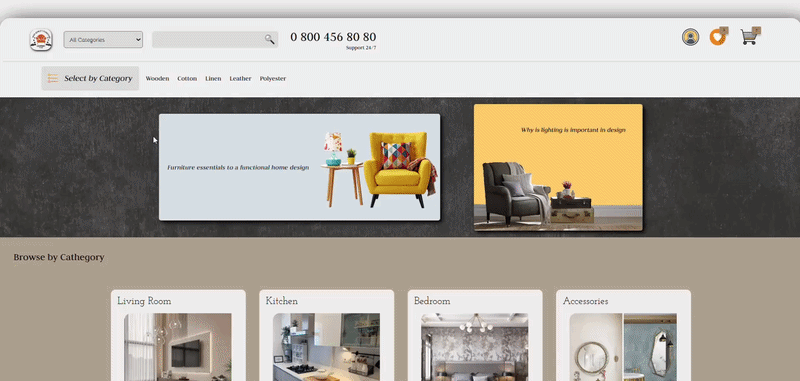

# 🏠 Home Furnishing Page

## 📖 Description
Home Furnishing Page is a responsive web page project built using **HTML and CSS**.  
The goal of this project is to recreate a given home furnishing layout while practicing **CSS Flexbox** and fundamental styling concepts.

## 🚀 Demo

### 🎬 Project Preview

### 🌐 Live Demo
👉 https://nursaadet.github.io/flex-project/

## 📂 Project Structure

Flex-project
│
├── README.md
├── flex.css
├── style.css
├── index.html
└── images/

## 🎯 Objectives

- Recreate the given Home Furnishing layout
- Practice modern CSS layout techniques
- Improve HTML & CSS coding skills

## 🛠️ Technologies
- HTML
- CSS (Flexbox)

## 🎯 What I Practiced
- Flexbox layout
- CSS positioning and display
- Page structure with HTML

